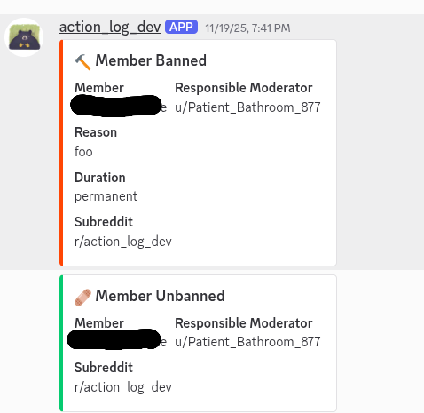
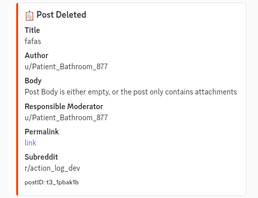
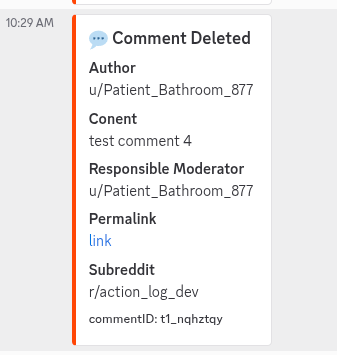
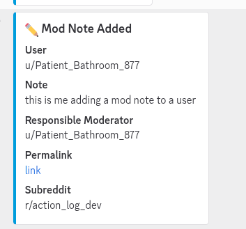
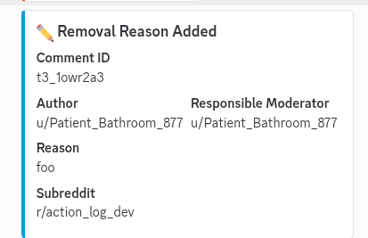

A simple app that logs mod actions to a discord channel using webhooks.  

Thanks to [Admin Tattler](https://developers.reddit.com/apps/admin-tattler) for the idea to include the original content of posts and comments.  

Currently supported actions:  

- member bans  
- member unbans  

- post removals  

- comment removals  

- mod notes  

- removal reasons  

[Github Repo](https://github.com/ijemmai/action-log)
[Devvit Page](https://developers.reddit.com/apps/action-log)

